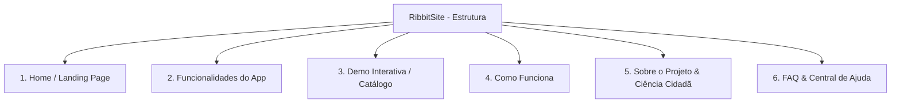

# Auditoria do Repositório RibbitApp

Este documento apresenta uma auditoria detalhada do repositório [RibbitApp](https://github.com/Hoennkeys/RibbitApp) com foco na extração das informações e dinâmicas que o portal público institucional (**RibbitSite**) precisa comunicar ao público, pesquisadores e desenvolvedores.

---

## 1. Resumo

O **RibbitApp** é um aplicativo mobile desenvolvido em **React Native** (utilizando TypeScript e JavaScript) voltado para a ciência cidadã, cujo objetivo principal é registrar, mapear e identificar espécies de anfíbios brasileiros através da bioacústica (gravação de cantos e coaxares). 

O app é integrado ao **Supabase** para gerenciamento de banco de dados PostgreSQL (com políticas de segurança em nível de linha - RLS), autenticação de usuários e armazenamento em nuvem de arquivos de áudio (sons gravados) e imagens (avatares). 

A dinâmica do aplicativo foca na colaboração científica:
* **Entusiastas** coletam e enviam áudios de coaxares e dados de geolocalização.
* **Pesquisadores e Revisores** avaliam e validam academicamente essas observações.
* **Gamificação** engaja os usuários por meio de ganho de pontos de experiência (XP) e promoção automática de títulos acadêmicos conforme contribuem para a plataforma.

A interface segue a risca o **Apple Design System**, priorizando uma estética minimalista, transições suaves e design premium baseado em tons de verde folha (`#34C759`), azul acentuado (`#0071E3`) e fundos claros (`#F5F5F7`).

---

## 2. Features Principais

Abaixo estão listadas as 12 principais features identificadas no código-fonte do aplicativo, acompanhadas de suas respectivas descrições técnicas:

1. **Autenticação e Controle de Sessão de Usuários**: Fluxo de cadastro, login e redefinição de credenciais integrado ao *Supabase Auth*. Suporta sessões persistentes e um fluxo de "Visitante" (Guest) que oculta abas restritas de salvamento de dados até que a conta seja criada.
2. **Captação de Áudio e Captura de Coaxar**: Módulo de gravação de áudio com limite de tempo (timer de 6 segundos) que utiliza o hardware de microfone do celular para capturar cantos de anfíbios.
3. **Geração de Espectrograma Acústico**: Componente visual customizado (`Spectrogram`) que renderiza dinamicamente ondas e frequências sonoras na tela durante gravações ou na reprodução do canto das espécies, transmitindo uma atmosfera de análise bioacústica real.
4. **Identificação de Áudio (Sound ID)**: Processamento de áudio que cruza o arquivo gravado com a lista de espécies cadastradas na base de dados (`dataService.getSpecies()`), sugerindo os anfíbios mais prováveis e exibindo a probabilidade de acerto (ex.: 96% de match).
5. **Assistente de Identificação Ecológica (Wizard)**: Questionário inteligente composto por 3 etapas consecutivas (localização do bioma, características do habitat e o tipo acústico do coaxar) para ajudar o usuário a filtrar e identificar espécies de forma dedutiva, dispensando gravações de áudio.
6. **Catálogo Geográfico e Filtro por Biomas**: Lista de anfíbios catalogados no Brasil com recursos de pesquisa por texto e filtragem rápida por biomas ou regiões geográficas (Mata Atlântica, Cerrado/Caatinga, Sudeste/Centro-Oeste).
7. **Ficha Técnica e Biologia da Espécie**: Exibição detalhada de cada anfíbio com nome popular, nome científico, descrição taxonômica detalhada, dicas de campo para identificação, fatos curiosos e áudio integrado do canto para comparação acústica.
8. **Mural de Discussão Científica**: Canal de comentários em cada espécie que permite a comunicação direta entre usuários comuns e revisores científicos, promovendo debates e anotações técnicas.
9. **Gamificação e Títulos de Usuário (XP)**: Atribuição automática de XP por tarefas (ex.: +50 XP ao submeter uma nova observação, +100 XP quando uma observação é aprovada). O sistema calcula os níveis e títulos do usuário automaticamente (ex.: "Novo Observador", "Coaxador Bronze", "Coaxador Prata", "Coaxador Ouro").
10. **Coleção Científica Pessoal (Life List)**: Seção individualizada no perfil do usuário que organiza e exibe seu histórico de observações submetidas, geolocalização e data.
11. **Moderação Acadêmica e Status de Revisão**: Fluxo interno de curadoria científica. Cada som enviado passa pelo status `pendente` e pode ser classificado como `aprovado` ou `rejeitado` por usuários com permissões elevadas.
12. **Upload de Mídias e Configuração do Perfil**: Permite a captura de fotos através da câmera ou galeria nativa do aparelho via `react-native-image-picker`, convertendo o arquivo em ArrayBuffer e enviando-o para o *Supabase Storage*.

---

## 3. Telas/Rotas e Componentes React

Abaixo está o mapeamento completo das telas e dos componentes da aplicação:

### Telas Principais (Screens)
* **Login ([LoginScreen.js](file:///c:/RibbitSite/RibbitApp/src/screens/LoginScreen.js))**: Formulário de autenticação. Integra-se com o Supabase Auth para verificar credenciais e gerenciar acesso de convidados (Guest).
* **Cadastro ([SignUpScreen.js](file:///c:/RibbitSite/RibbitApp/src/screens/SignUpScreen.js))**: Permite a criação de uma conta registrando Nome, E-mail e Senha. Salva o nome real do usuário nos metadados de cadastro.
* **Painel / Dashboard ([DashboardScreen.js](file:///c:/RibbitSite/RibbitApp/src/screens/DashboardScreen.js))**: Tela inicial pós-login. Exibe anúncios científicos da comunidade, descobertas recentes classificadas por biomas e raridade, e um feed de atividade pública em tempo real.
* **Sound ID ([SoundIdScreen.js](file:///c:/RibbitSite/RibbitApp/src/screens/SoundIdScreen.js))**: Tela central de identificação acústica. Contém o botão principal de gravação, o espectrograma e a lista de correspondências sugeridas para salvar a observação.
* **Explorar ([ExploreScreen.js](file:///c:/RibbitSite/RibbitApp/src/screens/ExploreScreen.js))**: Enciclopédia de anfíbios. Contém caixa de busca por nome popular/científico, botões horizontais de filtros de biomas e a lista de cartões das espécies.
* **Assistente ([WizardScreen.js](file:///c:/RibbitSite/RibbitApp/src/screens/WizardScreen.js))**: Questionário guiado de 3 perguntas para filtragem inteligente de anfíbios.
* **Perfil / Life List ([LifeListScreen.js](file:///c:/RibbitSite/RibbitApp/src/screens/LifeListScreen.js))**: Exibe dados do perfil do usuário (avatar, título e XP). A partir dela, acessam-se sub-views para:
  * **Minha Coleção**: Lista observações salvas do usuário e os respectivos status de revisão.
  * **Alterar Foto**: Permite capturar uma imagem com a câmera ou galeria.
  * **Alterar E-mail** e **Alterar Senha**: Telas para segurança cadastral.
* **Detalhes da Espécie ([SpeciesDetailsScreen.js](file:///c:/RibbitSite/RibbitApp/src/screens/SpeciesDetailsScreen.js))**: Ficha técnica completa de um anfíbio, incluindo player de áudio do coaxar com espectrograma animado, fatos curiosos e a seção de discussão científica.

### Componentes de Interface (Components)
* **Spectrogram ([Spectrogram.js](file:///c:/RibbitSite/RibbitApp/src/components/Spectrogram.js))**: Componente visual responsável por simular uma animação de frequências sonoras na tela.
* **FloatingActionButton ([FloatingActionButton.js](file:///c:/RibbitSite/RibbitApp/src/components/FloatingActionButton.js))**: Botão flutuante estilizado posicionado sobre a barra de navegação inferior.

---

## 4. Integrações e Dependências Externas

O aplicativo é estruturado sob o ecossistema React Native, dependendo das seguintes integrações cruciais:

* **Supabase Client (`@supabase/supabase-js`)**: Integração principal do backend.
  * **Supabase Auth**: Cadastros, logins e gerenciamento de sessões do usuário.
  * **Supabase Database (PostgreSQL)**: Armazena dados de usuários, espécies, observações (sons), revisões e comentários. RLS ativo para proteção de escritas ad-hoc.
  * **Supabase Storage**:
    * Bucket `sons`: Destinado a armazenar os arquivos de áudio gravados pelos usuários (MIME types aceitos: `mpeg, wav, mp3, ogg`).
    * Bucket `avatars`: Destinado a hospedar fotos de perfil dos observadores.
  * **Trigger de Banco (`on_auth_user_created`)**: Procedimento PL/pgSQL que insere automaticamente um novo registro na tabela pública `usuarios` quando uma conta é ativada no Supabase Auth.
* **React Navigation (`@react-navigation/native` / `bottom-tabs`)**: Fornece o sistema de rotas por abas estilizadas na parte inferior do aplicativo.
* **React Native Image Picker (`react-native-image-picker`)**: Conexão com as APIs nativas do Android e iOS para captura de mídias pela câmera do dispositivo ou seleção na galeria.
* **Base64 ArrayBuffer (`base64-arraybuffer`)**: Usado para converter o arquivo de imagem em formato ArrayBuffer binário no ambiente móvel, solucionando problemas de upload em rede para o Supabase Storage.
* **React Native SVG (`react-native-svg`)**: Usado para renderizar elementos de interface e vetores de forma fluida.

---

## 5. Endpoints e Dados a Documentar no Site

O website institucional do Ribbit deve conter uma seção de documentação técnica para desenvolvedores e parceiros acadêmicos. Os principais fluxos integrados que devem ser documentados são:

### 1. Chamadas de Autenticação (Supabase Auth)
* **Cadastro de Conta**:
  ```javascript
  supabase.auth.signUp({
    email,
    password,
    options: { data: { full_name } }
  })
  ```
* **Login de Usuário**:
  ```javascript
  supabase.auth.signInWithPassword({ email, password })
  ```
* **Log Out**:
  ```javascript
  supabase.auth.signOut()
  ```

### 2. Consultas e Estrutura do Banco de Dados
* **Obter Catálogo de Espécies (`species` / `especies`)**:
  Explicar os parâmetros de retorno (`nome_popular`, `nome_cientifico`, `regiao`, `habitat`, `descricao`, `fatos_curiosos`).
* **Submeter Observação (`observations` / `sons`)**:
  Cadastro de nova gravação e sua localidade GPS vinculando a uma espécie.
* **Sistema de Discussão (`comments` / `comentarios`)**:
  Adicionar notas e buscar discussões científicas por espécie.
* **Gamificação e Nível (`profiles` / `usuarios`)**:
  Atualização de XP e a mudança lógica de títulos (Bronze, Prata e Ouro).

### 3. Uploads de Mídia (Supabase Storage)
* **Upload de Áudio (Bucket `sons`)**: Upload com restrição de MIME-types (`audio/mpeg`, `audio/wav`, `audio/mp3`, `audio/ogg`).
* **Upload de Imagem (Bucket `avatars`)**: Conversão e envio em ArrayBuffer de fotos de perfil.

---

## 6. Recomendações de Telas para o Website (RibbitSite)

A fim de criar um site institucional moderno, premium e visualmente alinhado à estética do aplicativo, sugerimos a criação de uma aplicação web de página única (SPA) ou estruturada, dividida nas seguintes **6 seções/páginas principais**:



### 1. Home (Página Inicial)
* **Foco**: Conversão, download e impacto inicial.
* **Visual**: Fundo claro e moderno (`#F5F5F7`), tipografia elegante, um mockup realista do aplicativo exibindo o espectrograma animado.
* **Cores**: Predomínio do verde folha do app (`#34C759`) e azul acentuado (`#0071E3`).
* **Conteúdo**:
  * Chamada de impacto (Ex.: *"A voz da natureza registrada pela ciência. Mapeie a biodiversidade de anfíbios do Brasil pelo canto."*).
  * Botões de CTA para download (App Store e Google Play).
  * Contador estatístico interativo alimentado pelo Supabase (ex.: *1.420 anfíbios salvos*, *48 espécies catalogadas*, *250 pesquisadores ativos*).

### 2. Funcionalidades
* **Foco**: Apresentar os diferenciais técnicos do aplicativo.
* **Conteúdo**:
  * **Sound ID**: Explicação sobre como a captura acústica e análise espectrográfica ajudam a identificar anfíbios.
  * **Assistente Guiado (Wizard)**: Como identificar animais por exclusão lógica (bioma, som, habitat) quando não for possível gravar áudios.
  * **Gamificação**: Detalhes sobre o ganho de XP (observar dá +50 XP, validar dá +100 XP) e a subida de níveis comunitários.
  * **Fórum de Pesquisa**: A troca de dados e notas entre usuários de campo e herpetólogos acadêmicos.

### 3. Demo Interativa (Catálogo Web)
* **Foco**: Engajamento imediato no navegador.
* **Conteúdo**:
  * Catálogo web contendo as 4 espécies simuladas no app: **Sapo-cururu**, **Perereca-verde**, **Rã-pimenta** e **Sapinho-adornado**.
  * Players de áudio reais integrados ao site. Ao clicar em "Ouvir", um espectrograma de áudio animado em CSS/JS é exibido na tela, permitindo ao usuário comparar a frequência dos cantos.
  * Uma versão simplificada do **Assistente (Wizard)** simulada em tela para o usuário interagir e ver como o algoritmo filtra os anfíbios.

### 4. Como Funciona
* **Foco**: Didática e fluxos de uso.
* **Conteúdo**:
  * Guia gráfico de 4 passos ilustrados:
    1. **Encontre e Grave**: Vá a campo e faça um áudio do coaxar de 6 segundos.
    2. **Analise**: O app renderiza o espectrograma e sugere a espécie ideal.
    3. **Submeta**: Envie a gravação para o banco do Ribbit e receba +50 XP de contribuição científica.
    4. **Valide**: Cientistas da comunidade revisam seu áudio. Se aprovado, você recebe +100 XP adicionais e ajuda a monitorar a biodiversidade brasileira.

### 5. Sobre o Projeto & Ciência Cidadã
* **Foco**: Proposta científica, institucional e parcerias.
* **Conteúdo**:
  * Explicação sobre a importância da Ciência Cidadã (Citizen Science) na herpetologia. Como os anfíbios funcionam como bioindicadores ambientais cruciais.
  * Informações sobre a tecnologia envolvida (React Native, PostgreSQL, Supabase).
  * Espaço dedicado à captação de pesquisadores, com um formulário de solicitação de conta de **Revisor Acadêmico** ou parceiro de universidade.

### 6. FAQ (Perguntas Frequentes)
* **Foco**: Suporte rápido e dúvidas comuns.
* **Conteúdo**:
  * O aplicativo é gratuito e livre de anúncios? (Sim, sem fins lucrativos).
  * Como é calculada a precisão do Sound ID?
  * Os dados de localização geográfica do animal são públicos? (Sim, para fins de mapeamento científico).
  * Como posso me tornar um Revisor ou Administrador no app?
  * O app funciona offline? (O catálogo fica disponível, mas envios requerem conexão).
